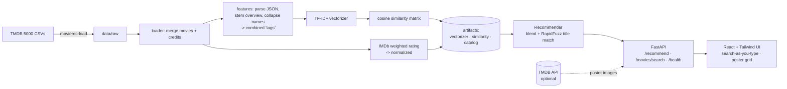

# 🎬 Movie Recommender

A content-based movie recommendation service over the
[TMDB 5000](https://www.kaggle.com/datasets/tmdb/tmdb-movie-metadata) dataset.
TF-IDF + cosine similarity on a combined tag field (overview, genres, keywords,
top cast, director), **blended with an IMDb-style popularity score**, served by
a FastAPI backend and a React + TypeScript + Tailwind frontend.

- **Live demo (frontend):** https://movie-recommender-harshh30.vercel.app
- **Live API:** https://movie-api-production-bdf9.up.railway.app ( `/docs` for OpenAPI )

> The live demo currently runs on the **synthetic sample dataset** (6 movies), so
> recommendations are limited until the real TMDB 5000 CSV is loaded (`movierec-load`)
> and the backend rebuilt. The pipeline and API are otherwise fully functional.
- **Stack:** Python 3.11 · scikit-learn · FastAPI · RapidFuzz · React · Vite · TypeScript · Tailwind · Docker

> **Honesty note.** A content-based recommender has **no ground-truth accuracy**,
> so this project does **not** report an "accuracy" number and makes no
> user-retention claims. It reports Precision@10, Recall@10 and catalog coverage
> against a clearly-stated *proxy* for relevance (shared genres/keywords). The
> methodology is spelled out below so the numbers are reproducible.

---

## Problem statement

Given a movie a user likes, surface a short list of similar-but-worth-watching
titles. "Similar" is handled by content features; "worth watching" is handled by
a popularity signal so the results aren't obscure look-alikes. Typos and partial
titles must resolve gracefully ("dark night" → "The Dark Knight"), and an unknown
title must return a helpful suggestion list, not a stack trace.

## Architecture



**Ranking.** `final = α · cosine_similarity + (1 − α) · normalized_weighted_rating`,
with `α` (`MOVIEREC_BLEND_ALPHA`, default `0.7`) exposed as config. The popularity
term is the IMDb weighted rating
`WR = (v/(v+m))·R + (m/(v+m))·C`, where `R`=vote average, `v`=vote count,
`C`=catalog mean rating, `m`=the 80th-percentile vote count.

## Monorepo layout

```
backend/    FastAPI + recommender (Python)   → deploy to Render/Railway (Docker)
frontend/   React + Vite + TS + Tailwind     → deploy to Vercel
```

## Quickstart

**Backend** (4 commands):

```bash
cd backend
python -m venv .venv && source .venv/bin/activate
pip install -e ".[dev,data]"
movierec-build                      # build artifacts (synthetic if no CSV)
uvicorn movie_rec.api.main:app --reload    # http://localhost:8000/docs
```

Fetch the real dataset first (optional, needs a Kaggle token — see `.env.example`):

```bash
movierec-load
```

**Frontend:**

```bash
cd frontend
npm install
cp .env.example .env      # point VITE_API_URL at the backend
npm run dev               # http://localhost:5173
```

## Dataset & license

- **Source:** "TMDB 5000 Movie Metadata" on Kaggle —
  <https://www.kaggle.com/datasets/tmdb/tmdb-movie-metadata> (`tmdb_5000_movies.csv`
  + `tmdb_5000_credits.csv`, ~4,800 films).
- **Attribution:** This product uses the TMDB API but is **not endorsed or
  certified by TMDB**. Review the dataset's license on its Kaggle page before
  redistribution.
- **The raw CSVs are not committed** (see `.gitignore`); `movierec-load` fetches
  them via `kagglehub`.

## Evaluation

**There is no ground-truth relevance label**, so relevance is a transparent
proxy: two movies are "relevant" if their combined **genre + keyword** token sets
share at least `min_overlap` tokens (default 2). Under that proxy:

- **Precision@k** — fraction of the top-k recommendations that are relevant.
- **Recall@k** — relevant items retrieved in the top-k ÷ `min(total relevant, k)`.
- **Catalog coverage** — fraction of distinct catalog items that ever appear in
  any query's top-k (a diversity check against always recommending the same hits).

> ⚠️ The numbers below were measured on the tiny **synthetic sample** (6 movies,
> `k=3`) used for tests/CI — they demonstrate the harness, not real performance.
> Regenerate on the real dataset before quoting them.

| Metric | Value (synthetic, k=3) |
|---|---:|
| Precision@k | 0.556 |
| Recall@k | 0.833 |
| Catalog coverage | 1.000 |

**Reproduce on real data:**

```bash
cd backend
movierec-load
movierec-evaluate --no-synthetic --k 10 --sample 1000
```

Then paste the printed Precision@10 / Recall@10 / coverage here, and note the
sample size.

## Why TF-IDF + cosine (and not embeddings)?

TF-IDF over a curated tag field is a strong, **transparent, zero-cost** baseline:
it needs no GPU, is fully explainable (you can read the tags that drove a match),
and the similarity matrix precomputes once. Its weakness is semantics — it can't
tell that "spaceship" and "starship" are related. The clear upgrade is swapping
the vectorizer for **sentence-transformer embeddings** (e.g. `all-MiniLM-L6-v2`)
over the overview, which captures paraphrase and synonymy at the cost of a model
dependency and heavier inference. The pipeline is structured so only the
vectorization step changes.

## API

| Endpoint | Description |
|---|---|
| `GET /recommend?title=&k=10` | Recommendations for a (fuzzy-matched) title. `404` with `suggestions` if no match. |
| `GET /movies/search?q=` | Title search-as-you-type for the frontend. |
| `GET /health` | Liveness + whether artifacts are loaded. |

```bash
curl "http://localhost:8000/recommend?title=dark%20night&k=5"
```

Includes RapidFuzz fuzzy title matching, SlowAPI rate limiting, structured JSON
logging, CORS for the Vercel frontend, and OpenAPI docs at `/docs`.

## Deploy

- **Backend → Render/Railway:** build `backend/Dockerfile` (bakes artifacts at
  build time). Set `PORT` (auto), and `MOVIEREC_TMDB_API_KEY` if you want posters.
- **Frontend → Vercel:** set the project root to `frontend/`, framework Vite, and
  `VITE_API_URL` to the backend URL. `vercel.json` handles SPA rewrites.

## Development

```bash
# backend
cd backend && ruff check src tests && black --check src tests && pytest --cov=movie_rec
# frontend
cd frontend && npm run build      # tsc type-check + vite build
```

CI (`.github/workflows/ci.yml`) runs backend lint+tests+Docker build and the
frontend type-check+build on every push.

## License

MIT — see [LICENSE](LICENSE). Dataset license is governed by Kaggle/TMDB.
